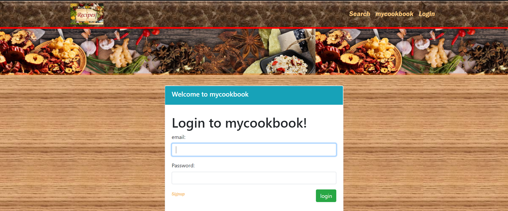
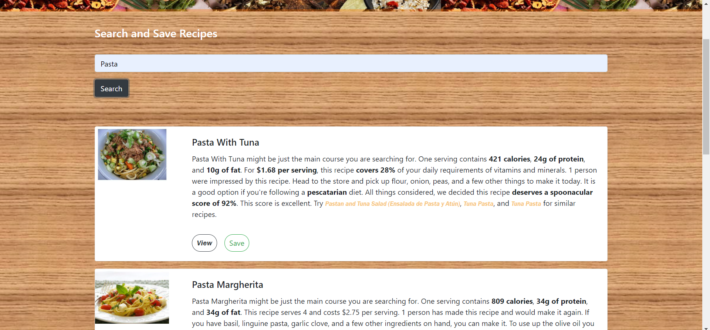

# My Cookbook

## Description
My Cookbook is a React-based app that allows users to search for recipes and save them for future reference. 

## Installation
This App is deployed on Heroku: [My Cookbook](https://immense-chamber-63705.herokuapp.com/) 
<!-- Remember to change this -->

## Application Features
In this application the user is able to search for recipes using Spoonacular's API. The application will display the results. The user can view the recipe summary and save the books. The saved books can be viewed using the "Saved" option from the Navigation bar.

## Technologies used
The app uses the following technologies:

- MongoDB

- Spoonacular API

- Passport

- React

- Bootstrap

- Babel

- react-html-parser

## Usage

`Save` button to save the recipe to the database. 
Click on the recipe to be taken to the recipe's webpage.

## Screenshots

